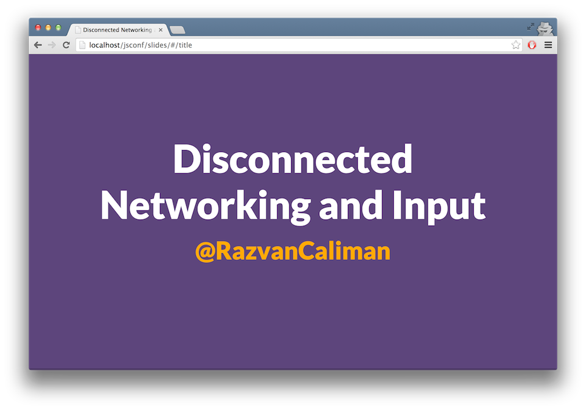

# Disconnected Networking and Input

Slides and demos from my talk at [JSConf.eu 2015](http://2015.jsconf.eu) about unconventional ways to transmit data and input.

This is an interactive slide deck meant to be presented on stage within a controlled environment.

Some demos and slides may not work as expected on your machine. Demos are expected to work in Chrome 45 with the "Experimental Web Platform features" flag turned on in `chrome://flags`.

## Credits

*   [Timex Datalink watch commercial](https://www.youtube.com/watch?v=p3Pzxmq-JLM)
*   [sonicnet.js by Boris Smus](https://github.com/borismus/sonicnet.js)
*   [doppler.js by Daniel Rapp](https://github.com/DanielRapp/doppler)
*   [Google Tone extension for Chrome](https://chrome.google.com/webstore/detail/google-tone/nnckehldicaciogcbchegobnafnjkcne?hl=en)
*   [Heliograph from Wikipedia](https://commons.wikimedia.org/wiki/File:Heliograph.jpg)
*   [Signal Lamp from Wikipedia](https://commons.wikimedia.org/wiki/File:US_Navy_020623-N-5329L-007_Signalman_2nd_Class_Eric_Palmer_signals_the_U.S._Navy_mine_hunter_coastal_ship_USS_Raven_(MHC_61.jpg)
*   [Michigan Micro Mote](http://www.eecs.umich.edu/eecs/about/articles/2015/Worlds-Smallest-Computer-Michigan-Micro-Mote.html)
*   [Misfit Shine](https://www.youtube.com/watch?v=HEeo1QVkwCo)
*   [Magnetic input for VR by Boris Smus](http://smus.com/magnetic-input-mobile-vr/)
